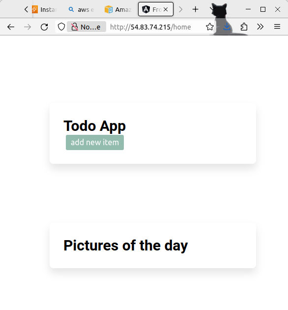

# Documentation

## Initial Setup
- Create 3 `Amazon Linux 2023` EC2 instances
- Expose port `22` on all instances for IPs from which you wish to shell in to.
- Run `setup` playbook
- Run `copyDirectories` playbook

### Frontend
- `docker build -t frontend --build-arg APIURL=http://172.31.25.118:8090 ./frontend`

**`APIURL`** should match the ip and port exposed on the machine running the `backend`.

- `sudo docker run -d --name frontend -p 80:80 frontend`
- confirm the site is live by accessing its public ip address.

### Backend
- `docker build -t backend ./backend`
- `docker run -d --name backend -p 172.31.25.118:8090:8080 -e PORT=8080 -e DBURL=172.31.20.244 -e DBUSER=root -e DBPASSWORD=password -e DBDATABASE=todo -e DBPORT=3306 backend`

**`-p`** should match the ip and port exposed on the machine running the `backend`. **`DBURL (and DBPORT)`** should match the ip and port of the machine running the `database`.

### Database
- `docker run -d --name database -p 172.31.20.244:3306:3306 -v /home/ec2-user/database/init.sql:/data/application/init.sql -e MYSQL_ROOT_PASSWORD=password mysql:latest --init-file /data/application/init.sql`